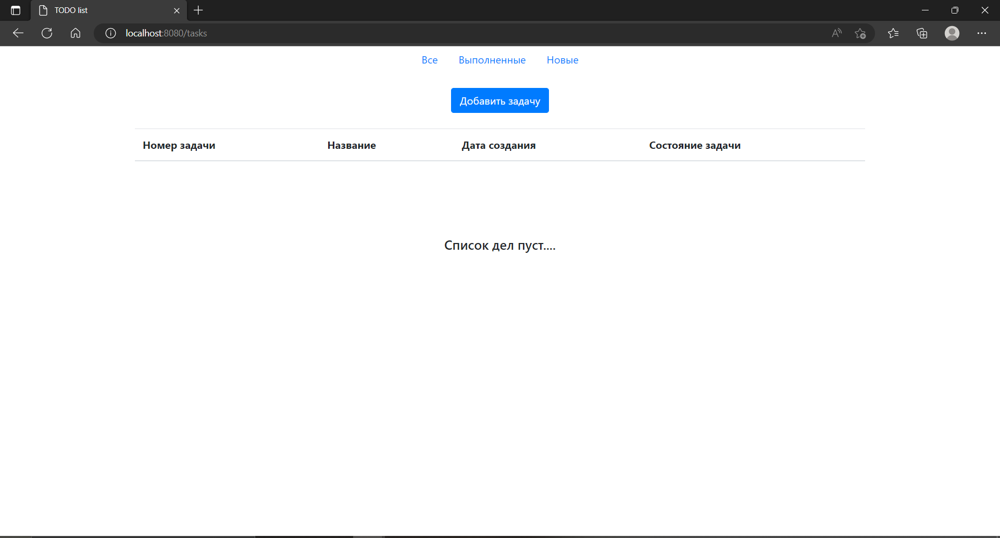
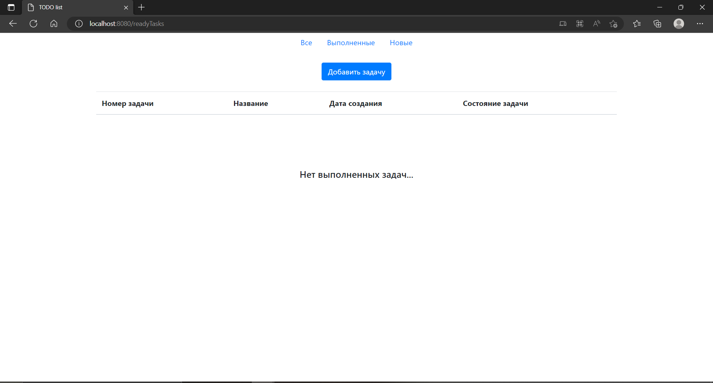
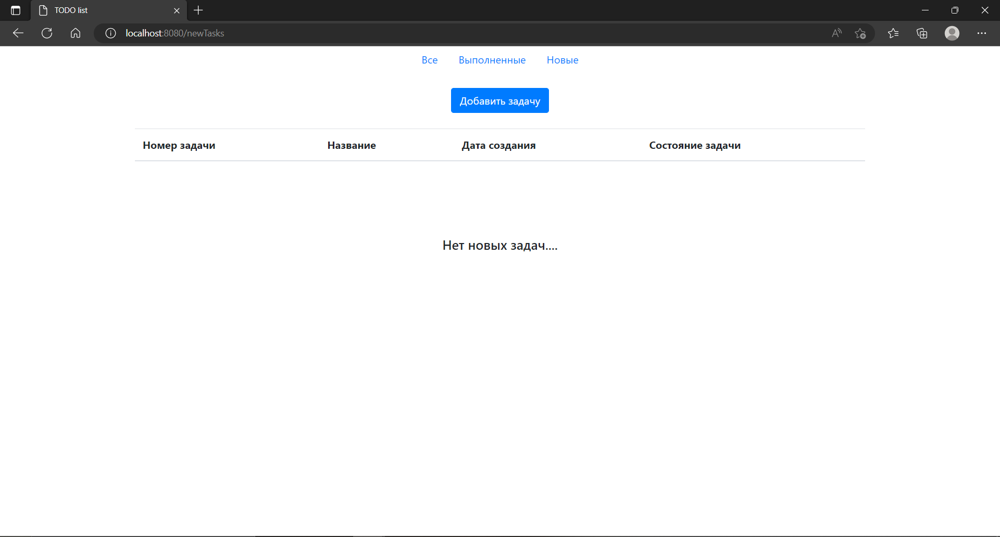
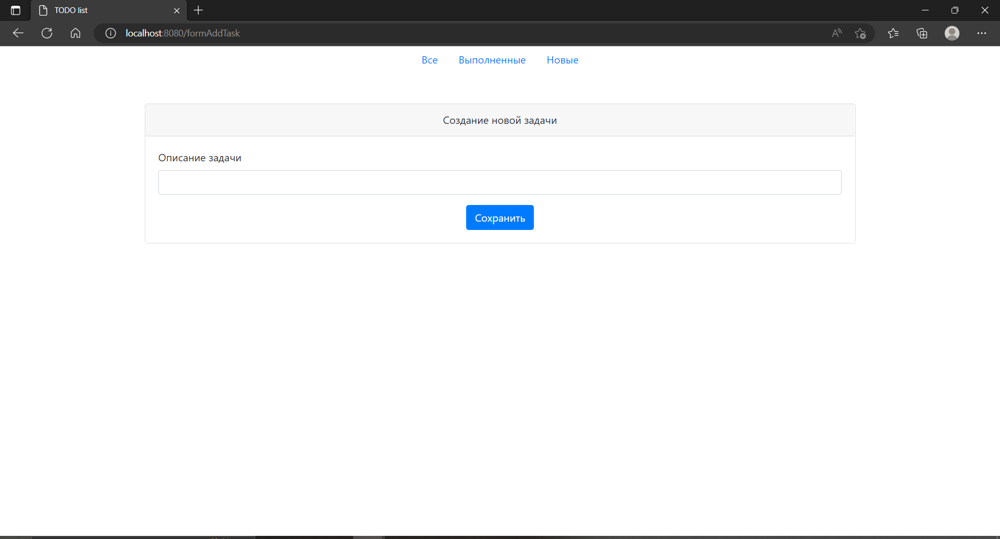
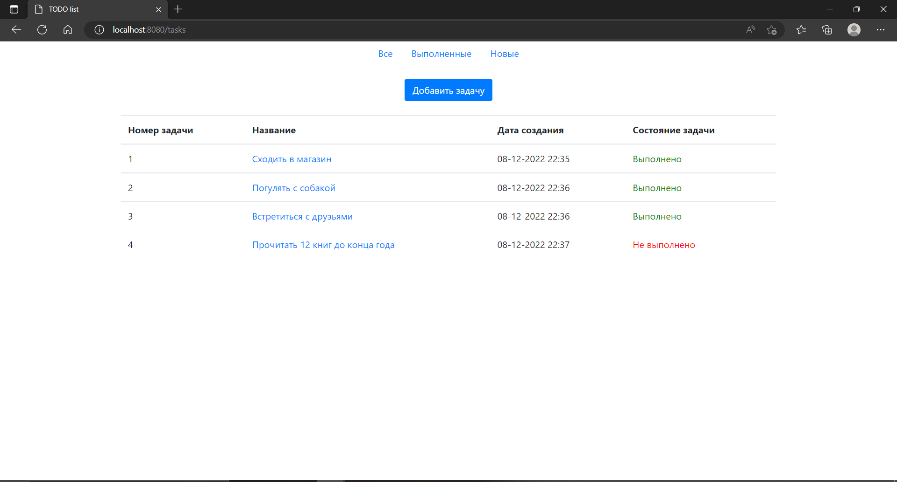
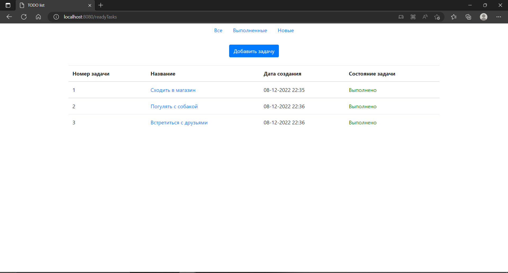
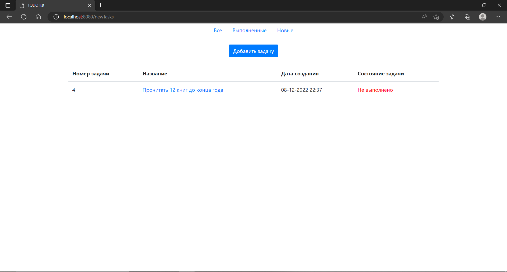
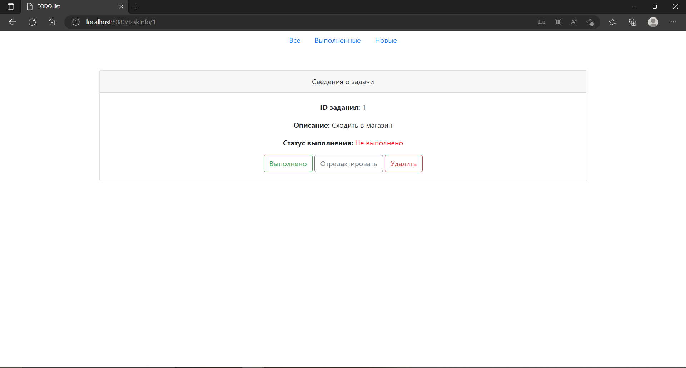
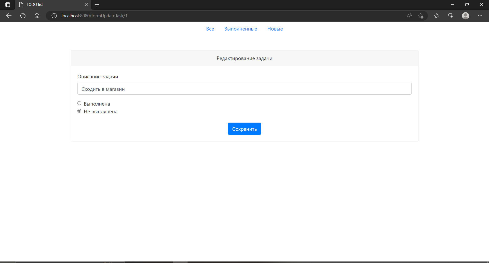

# job4j_todo
# Описание проекта
На главной странице представлен список всех заданий.
При нажатии на кнопку ***добавить задачу*** вы сможете создать новую задачу. Задача будет добавлена со статусом ***Не выполнена***.
Так же на странице со списком задач представлены 3 ссылки:
- ***Все***
- ***Выполненные***
- ***Новые***.

При переходе по ссылкам будут отображены: Все задачи, только выполненные, только новые.

При нажатии по описанию задачи будет произведен переход на странциу с подробным описанием.
На странице с описанием доступны 3 кнопки:
- ***Выполнена*** - задача переводится в состояние выполнено.
- ***Отредактировать*** - будет выполнен перевод на страницу для редактирования
- ***Удалить*** - удаляет задание
# Стек технологий
- Java 17
- SpringBoot 2.7.4
- Hibernate 5.6.11
- Thymeleaf 2.7.3
- Bootstrap 4.4.1
- PostgreSQL 14
- Lombok 1.18.22
- Checkstyle-plugin 3.1.2
- Liquibase 4.15.0
# Требования к окружению
- Java 17
- Maven 3.8
- PostgreSQL 14
# Запуск проекта
1. В PostgreSQL создать базу данных todo
```shell
jdbc:postgresql://127.0.0.1:5432/todo
```
2. Запустить проект
```shell
mvn spring-boot run
```
3. Перейти по адресу
```shell
3. http://localhost:8080/tasks
```
# Взаимодействие с приложением
### Главная страница без задач


### Страница Выполненные без задач


### Страница Новые без задач


### Добавление задачи


### Главная страница со всеми задачами


### Страница с выполненными задачами


### Страница с новыми задачами


### Страница с подробной информацией о задаче


### Страница редактирования задачи


# Контакты
- Telegram: https://t.me/ilya96s
- GitHub: https://github.com/Ilya96s